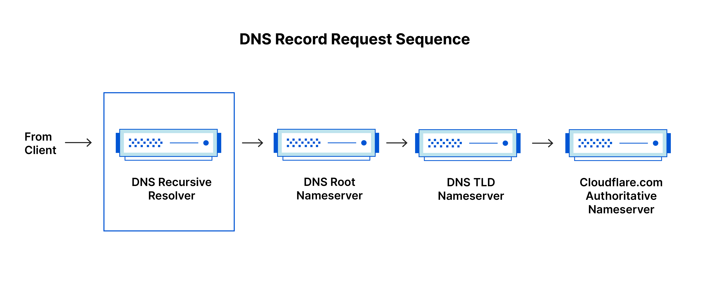
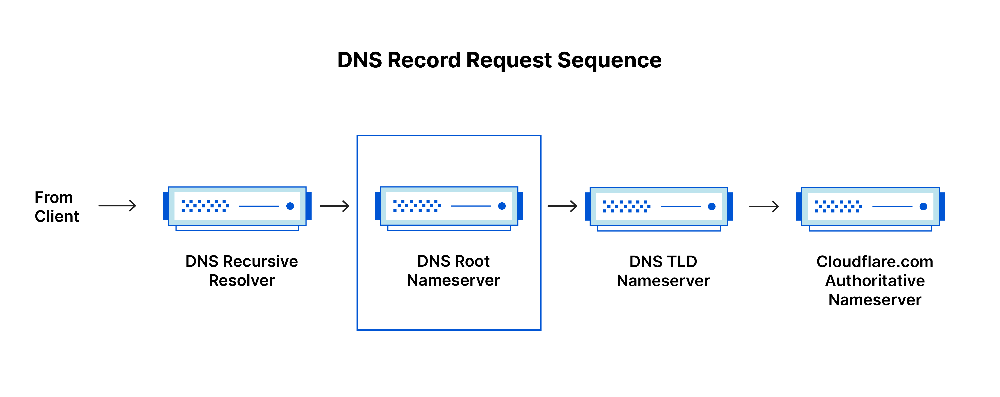
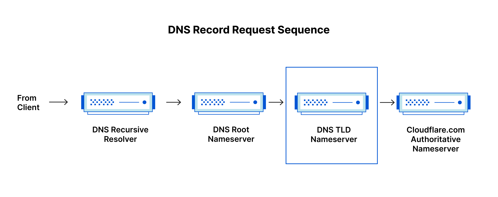

DNS 조회가 이루어지는 과정에 대해 알아봅니다.

## DNS란?

DNS(Domain Name System)은 전화번호부와 같은 역할을 합니다.

모든 호스트는 IP 주소를 가지고 있습니다.

하지만 IP 주소는 32비트 혹은 128비트의 숫자로 이루어져 있어 기억하기 어렵습니다. 
그래서 호스트의 IP 주소를 기억하기 쉬운 이름으로 대체할 수 있도록 도메인 네임을 사용합니다.

일일히 주소창에 `142.251.222.46`을 입력하는 것보다 `google.com`을 입력하는 것이 편리하겠죠?

이처럼 도메인 네임을 통해 IP 주소로 접속하는 과정을 DNS라고 합니다. 
DNS란 전화번호부에서 도메인은 이름으로, IP 주소는 전화번호로 비유할 수 있겠네요.

## DNS 서버

DNS 작업을 수행하는 서버를 DNS 서버라고 합니다.

DNS 서버는 DNS 확인자, 루트 서버, TLD 서버, 권한 서버로 분류할 수 있습니다.

### DNS Resolver

DNS Recursive Resolver, DNS Recursor, DNS Resolver,
재귀 DNS, 순환 DNS, DNS 확인자 등 다양한 이름으로 불립니다. 
이 글에서는 DNS 확인자로 표기하겠습니다.

DNS 확인자는 클라이언트와 DNS 서버 사이의 중개자입니다.

클라이언트로부터 쿼리를 받은 후 해당 도메인의 IP 주소를 찾기 위해 다른 DNS 서버에 쿼리를 보내고, 
최종적으로 클라이언트에게 IP 주소로 응답합니다.

> ### DNS 쿼리
>
> DNS 조회는 쿼리를 발생함에 따라 이루어집니다.
>
> **Recursive Query(재귀적 질의)**: 클라이언트와 DNS 확인자 간 통신에 사용되는 쿼리입니다. 
> **Iterative Query(반복적 질의)**: DNS 확인자와 다른 DNS 서버 간 통신에 사용되는 쿼리입니다.

한편 DNS 확인자는 DNS 캐시를 저장하기도 합니다.

즉, DNS 확인자는 권한 DNS로부터 제공받은 DNS 레코드를 저장합니다.

덕분에 동일한 레코드를 요청받을 때, 다른 DNS 서버들에 주소를 요청하는 과정을 건너뛰어 빠르게 IP 주소를 응답할 수 있을 뿐 아니라 네트워크 트래픽도 절약할 수 있습니다.

권한 DNS에 대해서는 아래에서 자세히 다루겠습니다.

대부분의 경우 ISP가 제공하는 로컬 DNS를 사용하지만, 
Google, Cloudflare, Cisco 등에서 제공하는 공용 DNS 서버를 사용할 수도 있습니다.

### Root Server

DNS는 계층적인 DNS Zone 트리 구조로 이루어져 있습니다. 
이때 루트 DNS 서버는 말 그대로 DNS Zone 트리의 루트(Root Zone)에 위치한 DNS 서버입니다.

루트 DNS 서버는 도메인 이름 중 최상위 도메인(TLD, Top-Level Domain)에 대한 정보만을 가지고 있습니다.

예를 들면 DNS 확인자가 `google.com`을 질의하면 루트 DNS 서버는 `.com` 서버의 IP 주소를 DNS 확인자에게 보내 응답합니다.

루트 DNS 서버는 전 세계에 13개가 있으며, ICANN에 의해 관리됩니다.

### TLD Server

TLD는 최상위 도메인(Top-Level Domain)을 의미합니다. 
예를 들면 `.com`, `.org`, `.kr` 등이 있겠네요.

TLD 서버는 이러한 TLD에 속하는 모든 하위 도메인 네임 서버의 IP 주소를 가지고 있습니다.

DNS 확인자는 TLD 서버에게 해당 도메인의 권한이 있는 네임 서버의 IP 주소를 요청합니다.

### Authoritative Server

권한 DNS 서버는 특정 도메인에 대한 IP 주소를 가지고 있는 DNS 서버입니다.

IP 주소는 DNS 레코드를 통해 응답받을 수 있습니다.

도메인의 IPv4 주소를 나타내는 경우 `A` 레코드를, 
도메인의 IPv6 주소를 나타내는 경우 `AAAA` 레코드를 사용합니다.

## DNS 조회 과정

DNS 조회의 전체적인 과정을 나타내면 다음과 같습니다.

1. 웹 브라우저에 도메인 네임을 입력하면 DNS 확인자가 도메인 네임의 캐시된 IP 주소를 찾습니다.
2. 캐시된 IP 주소가 없다면 DNS 확인자는 루트 DNS 서버를 쿼리합니다.
3. 루트 DNS 서버는 DNS 확인자에게 TLD 서버의 IP 주소로 응답합니다.
4. DNS 확인자는 TLD 서버에게 권한 서버의 IP 주소를 요청합니다.
5. TLD 서버는 DNS 확인자에게 권한 서버의 IP 주소로 응답합니다.
6. DNS 확인자는 네임 서버에게 도메인 네임의 IP 주소를 요청합니다.
7. 네임 서버는 DNS 확인자에게 도메인 네임의 IP 주소로 응답합니다.
8. DNS 확인자는 도메인 네임의 IP 주소를 캐시하고 클라이언트에게 응답합니다.
9. 브라우저가 IP 주소에 해당하는 서버에게 HTTP 요청을 보냅니다.
10. 서버는 브라우저에게 HTTP 응답을 보냅니다.

## 참고

https://www.cloudflare.com/ko-kr/learning/

https://www.icann.org/root-server-system-en