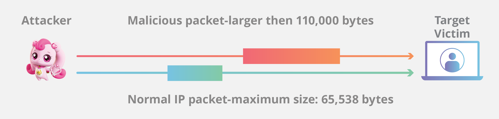

프로토콜의 정의와 TCP, UDP 프로토콜의 차이를 알아보고, 각 프로토콜의 특성을 활용한 DDoS 공격에 대해 알아봅니다.

## 프로토콜이란?

호스트 사이 데이터 통신을 위해 정의한 규칙입니다.

프로토콜은 OSI 7계층 모델을 기반으로 분류됩니다.

사용자의 데이터와 직접 상호작용하는 프로토콜은 계층 7(Layer 7, L7)에 분류됩니다.

응용 계층이라고도 불리며, 이 프로토콜에는 우리에게 친숙한 HTTP와 SMTP, FTP가 있습니다.

웹 서핑을 할 때에 HTTP 프로토콜을, 
이메일을 주고 받을 때에는 SMTP 프로토콜을 사용하며, 
컴퓨터 간 파일 전송 시에는 FTP 프로토콜을 사용합니다.

비록 소프트웨어 애플리케이션이 응용 계층에 의지하지만, 둘의 구분은 명확합니다.

HTTP와 Chrome은 서로 다른 것이며, HTTP는 Chrome이 데이터를 주고받을 때 사용하는 규칙임을 생각해보면 이해하기 쉽습니다.

클라이언트와 서버 사이의 데이터 전송을 담당하는 프로토콜은 계층 4(L4)에 분류됩니다. 
전송 계층이라고도 불리며, 이 프로토콜에는 TCP와 UDP가 있습니다.

## TCP (Transmission Control Protocol)

전송 제어 프로토콜(TCP)은 연결 지향적인 프로토콜입니다.

**높은 신뢰성**을 보장하기에 대부분의 웹 서비스에서 사용됩니다.

- 연결 지향 방식 (가상 회선 제공)
    - `3-way handshake`를 통해 연결
    - `4-way handshake`를 통해 연결 해제
- 패킷[^1]의 순서를 보장
- 패킷의 신뢰성을 보장
- 속도가 느림

연결 지향적이란 뜻은 클라이언트와 서버가 연결되어 데이터를 주고받음을 의미합니다. 
즉 TCP는 클라이언트와 서버를 연결하여 패킷을 주고받기 위해 가상의 논리적 경로를 배정합니다.

이때 데이터를 주고받기 위해 연결을 맺는 과정을 `handshake`라고 합니다. 
이 과정에서 패킷이 수신되어야 하는 순서를 나타내고 패킷이 의도한 대로 도착했는지 확인합니다. 
덕분에 데이터를 주고받을 때 패킷의 신뢰성이 보장됩니다. 
하지만 일련의 과정 때문에 속도가 느리다는 단점이 있습니다.

### TCP 연결 과정

다음과 같은 과정을 거쳐 연결을 맺습니다.

1. 클라이언트가 서버에서 `SYN` 패킷을 보냅니다.
2. 서버는 클라이언트에게 `SYN-ACK` 패킷을 보냅니다.
3. 클라이언트는 서버에게 `ACK` 패킷을 보내 연결을 맺습니다.

이후 `ESTABLISHED` 상태가 되어 데이터를 주고받을 수 있게 됩니다.

## UDP (User Datagram Protocol)

사용자 데이터그램 프로토콜(UDP)은 비연결 지향적인 프로토콜입니다.

**빠른 속도**를 보장하기에 실시간 스트리밍 서비스에서 사용됩니다.

- 비연결 지향 방식 (데이터그램 제공)
    - 데이터그램을 보내고 받는 방식
    - 데이터의 수신 여부를 확인하지 않음
- 패킷의 순서를 보장하지 않음
- 패킷의 신뢰성을 보장하지 않음
- 속도가 빠름

### UDP 연결 과정

## DDoS 공격

분산 서비스 거부 공격(DDoS)은 서버를 마비시키기 위한 공격입니다. 
여러 공격 방법이 있지만 이 글에서는 L4 프로토콜을 이용한 공격에 대해 알아보겠습니다.

### UDP Flood

UDP는 통신 시작 권한을 얻기 위한 `Handshake` 과정이 부재합니다. 
공격자는 이러한 특성을 활용하여 서버에 대량의 패킷을 전송, 서버를 마비시킬 수 있습니다.

1. 공격자는 대량의 악의적인 UDP 패킷을 임의의 포트로 전송합니다.
2. 서버는 패킷을 받아들이고 동일한 수의 ICMP 패킷[^2]으로 응답합니다. 
즉 해당 포트에 연결할 수 없음을 뜻합니다. (`Data Unreachable`)
3. 서버는 사기성 데이터그램에 응답하는 데 자원을 소모하게 되고 서비스가 마비됩니다.

TCP는 `Handshake` 과정이 있기 때문에 대량의 데이터를 전송하기 전에 연결을 맺어야 합니다. 
따라서 DDoS 공격에 안전한 것처럼 보입니다.

### SYN Flood

하지만 공격자는 SYN Flood 공격을 통해 TCP 연결을 맺는 과정에서 서버를 마비시킬 수도 있습니다. 

1. 공격자는 대량의 `SYN` 패킷을 서버에 전송합니다.
2. 서버는 `SYN` 패킷을 받아들이고 `SYN-ACK` 패킷을 응답합니다.
3. 공격자는 `ACK` 패킷을 보내지 않고 연결을 끊어 서버에 대량의 반개방(`half-open`) 연결을 남깁니다.
4. 서버는 반개방 연결을 처리하기 위해 자원을 소모하게 되고 서비스가 마비됩니다.

### Ping of Death

Ping of Death 공격은 ICMP 패킷을 이용하여 서버를 마비시키는 공격입니다. 

1. 공격자는 악의적으로 큰 크기의 ICMP 패킷을 서버에 전송합니다.
2. 패킷이 세그먼트로 분할됩니다.
3. 서버는 세그먼트를 재조립하려고 시도하며, 크기가 최대값을 초과하게 됩니다.
4. 서버는 버퍼 오버플로우로 인해 마비됩니다.

UDP Flood와 비슷하게 ICMP 패킷을 이용하여 서버를 마비시키지만 
Ping of Death 공격은 ICMP 패킷의 크기를 악의적으로 조작하여 서버를 마비시킵니다.

특히 일부 TCP 스택은 최대값보다 큰 패킷을 처리하도록 설계되지 않았으므로 더욱 취약합니다.
다행히도 이 공격은 현재 대부분의 서버에서 방어되고 있습니다.

## 결론

- 프로토콜은 호스트 사이 데이터 통신을 위한 규칙입니다.
- TCP는 연결 지향적이며 높은 신뢰성을 보장합니다.
- UDP는 비연결 지향적이며 빠른 속도를 보장합니다.
- DDoS 공격은 서버를 마비시키기 위한 공격입니다.
    - SYN Flood 공격은 TCP 연결을 맺는 과정에서 서버를 마비시킵니다.
    - UDP Flood 공격은 UDP 프로토콜의 특성을 활용하여 서버를 마비시킵니다.
    - Ping of Death 공격은 ICMP 패킷의 크기를 악의적으로 조작하여 서버를 마비시킵니다.

## 참고

https://www.cloudflare.com/ko-kr/learning/

https://dev-coco.tistory.com/144

## 참조
[^1]: 패킷(Packet) 
네트워크를 통해 전송되는 데이터의 최소 단위입니다.

[^2]: ICMP(Internet Control Message Protocol) 패킷 
ICMP 패킷은 오류 리포팅에 사용되는 패킷입니다. 
데이터가 도달하지 못한 경우 전송하는 장치와 공유할 오류를 생성합니다.

